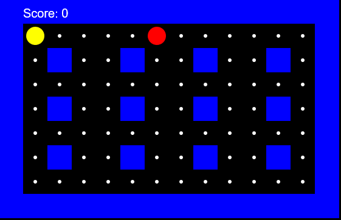

# PacmanJS
Pacman game developed in Vanilla Javascript. Still missing a bunch of resources and technical implementations and features like AI for enemies and movement.

## License
MIT License

## How to install
Just clone the repository and open the index.html on your browser.

## Example

## Author
Eduardo Diogo Garcia / eduardo.diogo@gmail.com